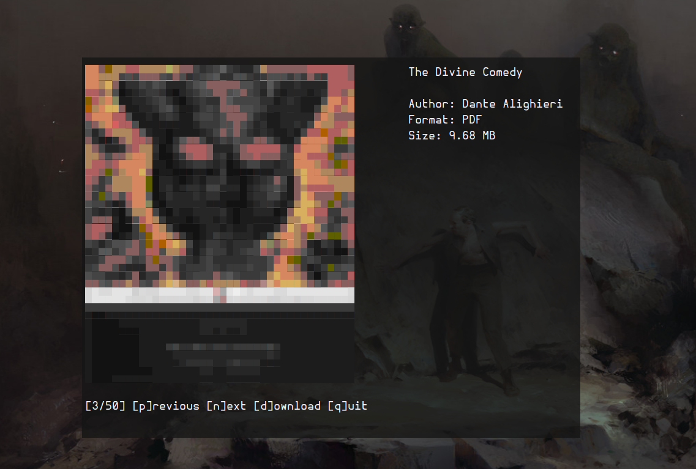

# bookmenu
TUI for LibGen using the InterPlanetary File System.  
Inspired by: https://lbry.tv/@metalx1000:c/retro-style-most-wanted:2



## requirements
- viu (https://github.com/atanunq/viu)
- wget

## installation
Arch based distros: ```$your_aur_helper -S bookmenu-git```  
> The PKGBUILD is currently missing 'viu' as a dependency, please install it (`pacman -S viu`) manually.  

Edit the script options as needed (ebook format, upstream links, output directory).

## usage
Launch the script with: ```bookmenu {query}```   
n -> go to the next book  
p -> go to the previous book  
d -> download the book  
q -> quit the tui  

## quirks 
If you are using the kitty terminal emulator replace viu with chafa.
